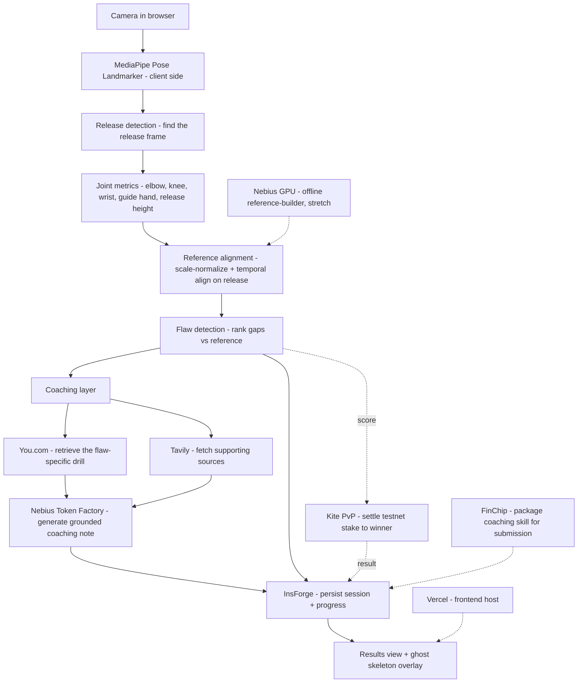

# Ghost — Architecture & Design

## 1. Problem

Most players literally can't see their own jump shot. You feel the shot from the
inside, but the flaw — a flying elbow, a guide hand that pushes, a dip that's too
shallow — lives in a view you never get to watch. Coaches fix this by standing
beside you and pointing at the gap between what you do and what good form looks
like. Without that reference, "perfect your shot" is unactionable advice. Ghost
recreates the coach's eye: it films one shot, finds your single biggest form
flaw, shows you the gap against a reference, and hands you one cited drill plus a
generated coaching note to close it.

## 2. System diagram

The spine is fully client-side through flaw detection. Only the coaching step
(You.com retrieval, Tavily sources, Nebius generation) and persistence (InsForge)
cross the network, and the drill/coaching calls are cached. The Kite PvP stake is
a side branch off the score — the core coaching product never depends on it.

## 3. Data flow

A capture's life, end to end:

1. **Birth — `ShotCapture`.** The capture component films the shot and runs
   MediaPipe per frame, producing `PoseFrame[]`. Wrapped with `fps`, a `view`
   (`side` primary), and an `id`, this is a `ShotCapture` — validated against
   `ShotCaptureSchema` in `src/lib/contracts.ts`.
2. **Analysis — `ShotCapture → AnalysisResult`.** `analyzeShot(capture)` detects
   the release frame, derives `JointMetrics`, scale-normalizes (by torso length)
   and temporally aligns the keypoints against the reference exemplar, ranks the
   deviations into `Flaw[]`, picks the `topFlaw`, computes a `score`, and attaches
   the aligned `ghostRef` pose to overlay. Output is an `AnalysisResult`.
3. **Coaching — `Flaw → CoachingResult`.** `coachFlaw(topFlaw)` retrieves a
   flaw-specific drill (You.com) and supporting citations (Tavily), then has
   Nebius Token Factory write a short coaching note grounded *only* in what was
   retrieved plus the user's real metrics. Returns a `CoachingResult`.
4. **Persistence.** The `AnalysisResult` (score, topFlaw, metrics) plus the
   `CoachingResult` are written to InsForge under the authenticated user, so the
   results/ghost-overlay view can render them and progress can be tracked across
   sessions.
5. **Optional PvP.** In a form battle, two users each record a shot, both scored
   by the same `analyzeShot`; the higher score wins and a small testnet stake
   settles on-chain to the winner via Kite. The outcome is persisted to InsForge.

The contract types are the only shapes that cross the A/B boundary, so either
half can be rebuilt independently as long as it honors `contracts.ts`.

## 4. Sponsor integrations

| Tool | Layer | What it does here | Why the product is worse without it |
|------|-------|-------------------|-------------------------------------|
| **You.com** | Product | Retrieves the flaw-specific corrective drill for the detected `topFlaw` — with a real citation, not generic tips. | Without it, feedback stops at "your elbow flares" with no fix. The drill is the actionable half of coaching; You.com turns a diagnosis into something you can go practice. |
| **Tavily** | Product | Searches and returns the supporting technique/biomechanics sources behind each drill for the references list. | Without it, drills are unsourced assertions a user has no reason to trust. Citations are the credibility layer — they let a skeptical player verify the advice isn't hallucinated. |
| **Nebius** | Product | Token Factory (OpenAI-compatible) inference writes the personalized coaching note from the retrieved sources + the user's real metrics. Optional stretch: serverless GPU offline reference-builder. | Without it, we'd show raw search results or a hand-templated note. Nebius makes the coaching read like a coach talking while staying grounded in retrieved facts. |
| **InsForge** | Infra | Auth + persistence: user accounts, stored sessions, and cross-session progress. | Without it, every shot is a throwaway. No accounts, no history, no progress arc — Ghost becomes a one-off toy instead of something you return to and improve with. |
| **Kite** | Product | Settles the player-vs-player "form battle" — the higher score wins a small testnet stake on-chain (Agent Passport + x402, faucet tokens). | Without it, PvP is just a scoreboard with no stakes. Kite makes the battle have consequence, which is the entire point of betting on your form. |
| **FinChip** | Submission | Packages the `coachFlaw` capability ("given a form flaw, return a cited corrective drill") as an ownable/tradeable skill asset for submission. | Without it, the submission is just an app link; FinChip frames the coaching as a reusable, ownable asset, which is the angle that submission track rewards. |
| **Trae / Replit** | Dev | AI IDE / build environment used to build Ghost as a two-person parallel build against frozen contracts ("built with"). | Without it, the parallel split-build is slower and the contract discipline is harder to hold; it's the velocity multiplier that made a one-day two-person build feasible. |
| **Growing Pines** | Submission | Overall-prize eligibility — nothing to integrate; it's the track the finished submission competes in. | Without it, the project isn't eligible for the overall prize; the requirement is simply that the submission be complete and strong, which the rest of this doc serves. |

Layers are honest: You.com, Tavily, Nebius, InsForge, and Kite touch the product
surface a user feels; Vercel hosts and the Nebius GPU builder is infra; Trae/
Replit are dev process; FinChip and Growing Pines are submission. We're not
pretending a host or a prize track is a product feature.

## 5. Key design decisions & tradeoffs

- **Off-the-shelf pose model, not a trained one.** We use MediaPipe's Pose
  Landmarker as-is. There's no labeled jump-shot dataset we could collect and
  train against in a day, and a half-trained model would be worse than a proven
  one. The real engineering is the analysis layer on top — release detection,
  alignment, flaw ranking — not the keypoint detector underneath it.
- **Directional, reference-based feedback — not absolute biomechanical
  precision.** This is the most important honesty in the project. A 2D pose
  estimate measures angles *in the image plane*, not true 3D joint angles. A
  camera that isn't perfectly side-on will read an elbow angle that's off by real
  degrees. So we deliberately do **not** report "your elbow is at 84.3°." We
  constrain capture to one view (side-on primary), compare against a reference,
  and report flaws *directionally* — "elbow flaring out," "release is late,"
  "dip too shallow." Directional feedback is robust to the exact thing 2D pose is
  bad at, and it's also how a human coach actually talks.
- **Reference alignment removes body-size and timing confounds.** Before
  comparing a user's pose to the ghost, keypoints are scale-normalized by torso
  length and the sequences are temporally aligned on the detected release frame.
  So the visible "gap" reflects *form*, not the fact that the user is taller than
  the reference or shot a beat earlier.
- **Retrieval-grounded coaching.** You.com and Tavily retrieve; Nebius generates.
  The generated note may not introduce facts absent from the retrieved sources —
  that's the guardrail against confident hallucinated advice.
- **Client-side inference for demo reliability.** Pose runs in the browser, so
  the core experience works without conference wifi. Only the drill/coaching
  calls are networked, and they're cached. A demo that doesn't depend on the
  venue's network is a demo that doesn't die on stage.

## 6. What we deliberately cut

- **Real-time multiplayer beyond the single PvP stake.** One async form battle,
  settled once. No lobbies, no live head-to-head.
- **Multi-sport.** Basketball jump shot only. The analysis layer is shot-specific
  on purpose.
- **Mobile-native apps.** Browser-only. No iOS/Android builds.
- **Absolute biomechanical scoring.** Covered above — directional feedback over
  false-precision degrees, no "your form is 87/100 vs the NBA average" claim we
  can't stand behind.
