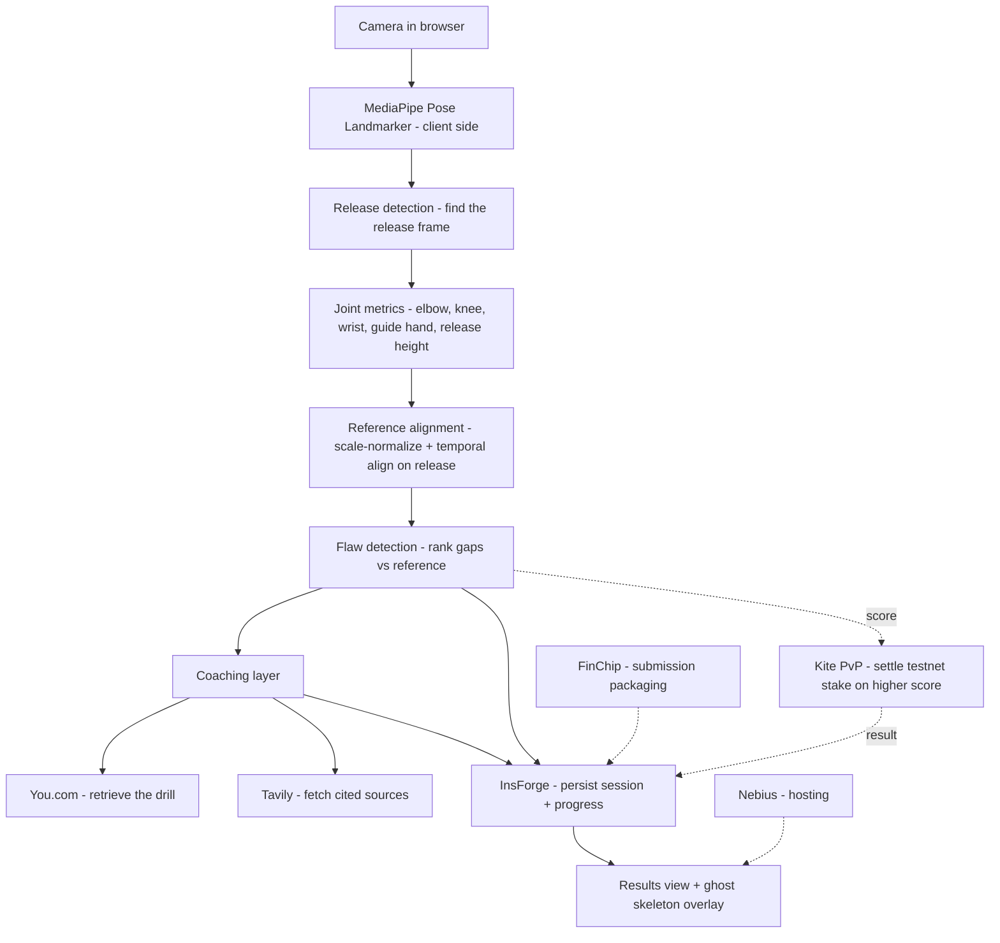

# Ghost — Architecture & Design

## 1. Problem

Most players literally can't see their own jump shot. You feel the shot from the
inside, but the flaw — a flying elbow, a guide hand that pushes, a dip that's too
shallow — lives in a view you never get to watch. Coaches fix this by standing
beside you and pointing at the gap between what you do and what good form looks
like. Without that reference, "perfect your shot" is unactionable advice. Ghost
recreates the coach's eye: it films one shot, finds your single biggest form
flaw, shows you the gap against a reference, and hands you one cited drill to
close it.

## 2. System diagram

The spine is fully client-side through flaw detection. Only the coaching fetch
(You.com + Tavily) and persistence (InsForge) cross the network, and the drill
fetch is cached. The Kite PvP stake is a side branch off the score — the core
coaching product never depends on it.

## 3. Data lifecycle

A capture's life, end to end:

1. **Birth — `ShotCapture`.** The capture component films the shot and runs
   MediaPipe per frame, producing `PoseFrame[]`. Wrapped with `fps`, a `view`
   (`side` primary), and an `id`, this is a `ShotCapture` — validated against
   `ShotCaptureSchema` in `src/lib/contracts.ts`.
2. **Analysis — `ShotCapture → AnalysisResult`.** `analyzeShot(capture)` detects
   the release frame, derives `JointMetrics`, scale-normalizes and temporally
   aligns the keypoints against the reference exemplar, ranks the deviations into
   `Flaw[]`, picks the `topFlaw`, computes a `score`, and attaches the aligned
   `ghostRef` pose to overlay. Output is an `AnalysisResult`.
3. **Coaching — `Flaw → CoachingResult`.** `coachFlaw(topFlaw)` retrieves a
   targeted drill (You.com) and citations (Tavily), returning a `CoachingResult`.
4. **Persistence.** The `AnalysisResult` (score, topFlaw, metrics) plus the
   `CoachingResult` are written to InsForge under the authenticated user, so the
   results/ghost-overlay view can render them and progress can be tracked across
   sessions.
5. **Optional settlement.** In a PvP match, two users' `score`s are compared and
   a small testnet stake is settled through Kite; the outcome is persisted back
   to InsForge.

The contract types are the only shapes that cross the A/B boundary, so either
half can be rebuilt independently as long as it honors `contracts.ts`.

## 4. Sponsor integrations

| Tool | Layer | What it does here | Why the product is worse without it |
|------|-------|-------------------|-------------------------------------|
| **You.com** | Product | Retrieves the targeted drill for the detected `topFlaw` — the specific corrective exercise, not generic tips. | Without it, feedback stops at "your elbow flares" with no fix. The drill is the actionable half of coaching; You.com is what turns a diagnosis into a thing you can go practice. |
| **Tavily** | Product | Searches and returns citation sources behind each drill (coaching articles, breakdowns) for the references list. | Without it, drills are unsourced assertions a user has no reason to trust. Citations are the credibility layer — they let a skeptical player verify the advice isn't hallucinated. |
| **InsForge** | Infra | Auth + persistence: user accounts, stored sessions, and cross-session progress. | Without it, every shot is a throwaway. No accounts, no history, no progress arc — Ghost becomes a one-off toy instead of something you return to and improve with. |
| **Nebius** | Infra | Hosting/deployment target for the app. | Without it, there's nowhere reliable to run the demo; we'd be on a laptop tunnel. Nebius is what makes the live URL real and shareable for judging. |
| **Kite** | Product (optional) | Settles the player-vs-player "form battle" — the higher score wins a small testnet stake on-chain. | Without it, the PvP mode is just a scoreboard with no stakes. Kite makes the battle have consequence, which is the entire point of betting on your form. |
| **FinChip** | Submission | Packages the project artifacts/metadata for hackathon submission. | Without it, submission is manual and error-prone under time pressure; FinChip standardizes what we hand the judges so nothing required is missing. |
| **Trae** | Dev | AI-assisted IDE used to build Ghost across two parallel branches. | Without it, the two-person parallel build is slower and the frozen-contract discipline is harder to hold; Trae is the velocity multiplier that made a one-day split-build feasible. |
| **Growing Pines** | Dev / Program | Hackathon program + support context the build runs within. | Without it, there's no venue, mentorship, or sponsor access that this project is built against; it's the frame that makes the whole integration surface available in the first place. |

Layers are honest: You.com, Tavily, and Kite touch the product surface a user
feels; InsForge and Nebius are infrastructure; Trae and Growing Pines are
dev/program; FinChip is submission plumbing. We are not pretending a hosting
provider is a product feature.

## 5. Key design decisions & tradeoffs

- **Off-the-shelf pose model, not a trained one.** We use MediaPipe's Pose
  Landmarker as-is. There's no labeled jump-shot dataset we could collect and
  train against in a day, and a half-trained model would be worse than a proven
  one. The real engineering is the analysis layer on top — release detection,
  alignment, flaw ranking — not the keypoint detector underneath it.
- **Directional, reference-based feedback — not absolute biomechanical
  precision.** This is the most important honesty in the project. A 2D pose
  estimate measures angles *in the image plane*, not true 3D joint angles. A
  camera that isn't perfectly side-on will read an elbow angle that's off by real
  degrees. So we deliberately do **not** report "your elbow is at 84.3°." We
  constrain capture to one view (side-on primary), compare against a reference,
  and report flaws *directionally* — "elbow flaring out," "release is late,"
  "dip too shallow." Directional feedback is robust to the exact thing 2D pose is
  bad at, and it's also how a human coach actually talks.
- **Reference alignment removes body-size and timing confounds.** Before
  comparing a user's pose to the ghost, keypoints are scale-normalized (by body
  segment length) and the sequences are temporally aligned on the detected
  release frame. So the visible "gap" reflects *form*, not the fact that the user
  is taller than the reference or shot a beat earlier.
- **Client-side inference for demo reliability.** Pose runs in the browser, so
  the core experience works without conference wifi. Only the drill fetch is
  networked, and it's cached. A demo that doesn't depend on the venue's network
  is a demo that doesn't die on stage.

## 6. What we deliberately cut

- **Real-time multiplayer beyond the single PvP stake.** One async form battle,
  settled once. No lobbies, no live head-to-head.
- **Multi-sport.** Basketball jump shot only. The analysis layer is shot-specific
  on purpose.
- **Mobile-native apps.** Browser-only. No iOS/Android builds.
- **Absolute biomechanical scoring.** Covered above — we chose directional
  feedback over false-precision degrees, and we're not shipping a "your form is
  87/100 vs the NBA average" claim we can't stand behind.
