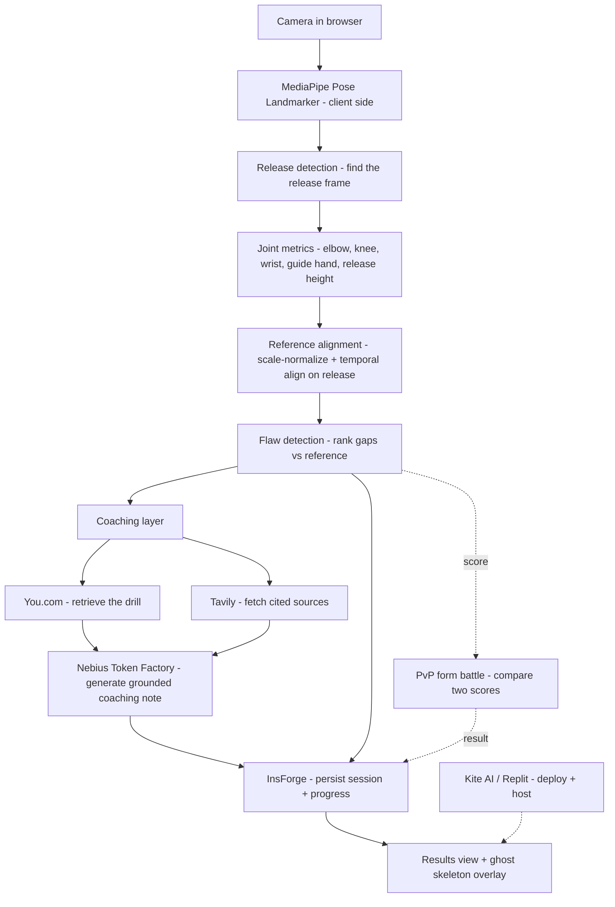

# Ghost — Architecture & Design

## 1. Problem

Most players literally can't see their own jump shot. You feel the shot from the
inside, but the flaw — a flying elbow, a guide hand that pushes, a dip that's too
shallow — lives in a view you never get to watch. Coaches fix this by standing
beside you and pointing at the gap between what you do and what good form looks
like. Without that reference, "perfect your shot" is unactionable advice. Ghost
recreates the coach's eye: it films one shot, finds your single biggest form
flaw, shows you the gap against a reference, and hands you one cited drill to
close it.

## 2. System diagram

The spine is fully client-side through flaw detection. Only the coaching step
(You.com retrieval, Tavily sources, Nebius generation) and persistence (InsForge)
cross the network, and the drill fetch is cached. The PvP form battle is a side
branch off the score — a local comparison of two players' scores, with no core
dependency on it.

## 3. Data flow

A capture's life, end to end:

1. **Birth — `ShotCapture`.** The capture component films the shot and runs
   MediaPipe per frame, producing `PoseFrame[]`. Wrapped with `fps`, a `view`
   (`side` primary), and an `id`, this is a `ShotCapture` — validated against
   `ShotCaptureSchema` in `src/lib/contracts.ts`.
2. **Analysis — `ShotCapture → AnalysisResult`.** `analyzeShot(capture)` detects
   the release frame, derives `JointMetrics`, scale-normalizes and temporally
   aligns the keypoints against the reference exemplar, ranks the deviations into
   `Flaw[]`, picks the `topFlaw`, computes a `score`, and attaches the aligned
   `ghostRef` pose to overlay. Output is an `AnalysisResult`.
3. **Coaching — `Flaw → CoachingResult`.** `coachFlaw(topFlaw)` retrieves a
   targeted drill (You.com) and citations (Tavily), then has Nebius Token Factory
   write a short coaching note grounded *only* in what was retrieved. Returns a
   `CoachingResult`.
4. **Persistence.** The `AnalysisResult` (score, topFlaw, metrics) plus the
   `CoachingResult` are written to InsForge under the authenticated user, so the
   results/ghost-overlay view can render them and progress can be tracked across
   sessions.
5. **Optional PvP.** In a form battle, two users' `score`s are compared directly
   and the outcome is persisted back to InsForge. No on-chain settlement — it's a
   skill-based score comparison for the demo.

The contract types are the only shapes that cross the A/B boundary, so either
half can be rebuilt independently as long as it honors `contracts.ts`.

## 4. Sponsor integrations

These are the tools Ghost actually integrates against, with honest layers.

| Tool | Layer | What it does here | Why the product is worse without it |
|------|-------|-------------------|-------------------------------------|
| **You.com** | Product | Retrieves the targeted drill for the detected `topFlaw` — the specific corrective exercise, with citations, not generic tips. | Without it, feedback stops at "your elbow flares" with no fix. The drill is the actionable half of coaching; You.com turns a diagnosis into something you can go practice. |
| **Tavily** | Product | Searches and returns the supporting technique/biomechanics sources behind each drill for the references list. | Without it, drills are unsourced assertions a user has no reason to trust. Citations are the credibility layer — they let a skeptical player verify the advice isn't hallucinated. |
| **Nebius (Token Factory)** | Product | OpenAI-compatible inference that writes the personalized coaching note from the retrieved sources + the user's real metrics. Retrieval finds the facts; Nebius writes them up. | Without it, we'd either show raw search results or hand-template the note. Nebius is what makes the coaching read like a coach talking, while staying grounded in retrieved facts. |
| **InsForge** | Infra | Auth + persistence: user accounts, stored sessions, and cross-session progress. | Without it, every shot is a throwaway. No accounts, no history, no progress arc — Ghost becomes a one-off toy instead of something you return to and improve with. |
| **Trae** | Dev | AI-assisted IDE used to build Ghost as a two-person parallel build against frozen contracts. | Without it, the parallel split-build is slower and the contract discipline is harder to hold; Trae is the velocity multiplier that made a one-day two-person build feasible. |

**Not integration tools, acknowledged honestly:**
- **Kite AI / Replit** — build & deploy environment for the live demo URL. A
  hosting rail, not a product feature.
- **Growing Pines** — event sponsor of the hackathon, not a tool Ghost calls.

## 5. Key design decisions & tradeoffs

- **Off-the-shelf pose model, not a trained one.** We use MediaPipe's Pose
  Landmarker as-is. There's no labeled jump-shot dataset we could collect and
  train against in a day, and a half-trained model would be worse than a proven
  one. The real engineering is the analysis layer on top — release detection,
  alignment, flaw ranking — not the keypoint detector underneath it.
- **Directional, reference-based feedback — not absolute biomechanical
  precision.** This is the most important honesty in the project. A 2D pose
  estimate measures angles *in the image plane*, not true 3D joint angles. A
  camera that isn't perfectly side-on will read an elbow angle that's off by real
  degrees. So we deliberately do **not** report "your elbow is at 84.3°." We
  constrain capture to one view (side-on primary), compare against a reference,
  and report flaws *directionally* — "elbow flaring out," "release is late,"
  "dip too shallow." Directional feedback is robust to the exact thing 2D pose is
  bad at, and it's also how a human coach actually talks.
- **Reference alignment removes body-size and timing confounds.** Before
  comparing a user's pose to the ghost, keypoints are scale-normalized (by torso
  length) and the sequences are temporally aligned on the detected release frame.
  So the visible "gap" reflects *form*, not the fact that the user is taller than
  the reference or shot a beat earlier.
- **Retrieval-grounded coaching.** The Nebius-written note is constrained to what
  You.com and Tavily actually returned. If a claim isn't in the retrieved
  sources, it doesn't go in the note — that's the guardrail against confident
  hallucinated advice.
- **Client-side inference for demo reliability.** Pose runs in the browser, so
  the core experience works without conference wifi. Only the coaching fetch is
  networked, and it's cached. A demo that doesn't depend on the venue's network
  is a demo that doesn't die on stage.

## 6. What we deliberately cut

- **On-chain stakes for PvP.** The form battle is a local, skill-based score
  comparison persisted in InsForge — no testnet wallet, no chain settlement. It
  was scope we didn't need to prove the idea.
- **Real-time multiplayer.** One async form battle, compared once. No lobbies, no
  live head-to-head.
- **Multi-sport.** Basketball jump shot only. The analysis layer is shot-specific
  on purpose.
- **Mobile-native apps.** Browser-only. No iOS/Android builds.
- **Absolute biomechanical scoring.** Covered above — directional feedback over
  false-precision degrees, no "your form is 87/100 vs the NBA average" claim we
  can't stand behind.
